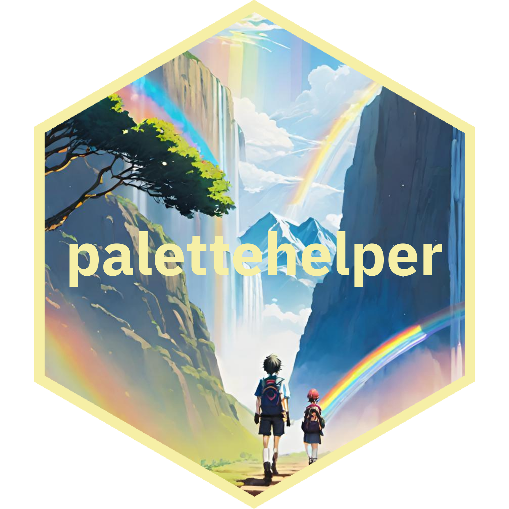
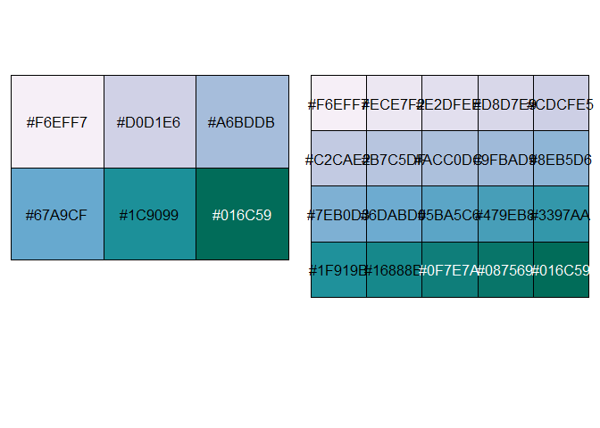

<!-- README.md is generated from README.Rmd. Please edit that file -->

# palettehelper 

# palettehelper

<!-- badges: start -->

[](https://lifecycle.r-lib.org/articles/stages.html#experimental)
[](https://CRAN.R-project.org/package=palettehelper)
<!-- badges: end -->

The goal of `palettehelper` is to help you build and manage color
palettes in R for data viz. I mostly made it for myself!

## Installation

You can install the development version of `palettehelper` from
[GitHub](https://github.com/) with:

``` r
# install.packages("devtools")
devtools::install_github("MargaretSiple-NOAA/palettehelper")
```

## Example

Expand the very beautiful (but short) color palettes from your favorite
palette package.

``` r
library(RColorBrewer)
library(palettehelper)


pal <- RColorBrewer::brewer.pal(n = 6,name = "PuBuGn")
longer_pal <- palettehelper::lengthen_pal(shortpal = pal, newlength = 20)
print(longer_pal)
#>  [1] "#F6EFF7" "#ECE7F2" "#E2DFEE" "#D8D7E9" "#CDCFE5" "#C2CAE2" "#B7C5DF"
#>  [8] "#ACC0DC" "#9FBAD9" "#8EB5D6" "#7EB0D3" "#6DABD0" "#5BA5C6" "#479EB8"
#> [15] "#3397AA" "#1F919B" "#16888B" "#0F7E7A" "#087569" "#016C59"
```

``` r

par(mfrow=c(1,2))
scales::show_col(pal)
scales::show_col(longer_pal)
```




[U.S. Department of Commerce](https://www.commerce.gov/) \| [National
Oceanographic and Atmospheric Administration](https://www.noaa.gov) \|
[NOAA Fisheries](https://www.fisheries.noaa.gov/)
